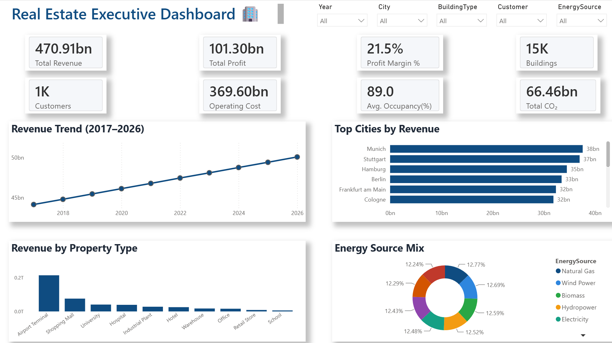

# 🏢 Real Estate Business Intelligence Platform

An end-to-end Business Intelligence solution designed to analyze commercial real estate performance using **Python, SQL Server and Power BI**.

This project simulates an enterprise-grade BI environment by generating realistic business data, building a SQL Server data warehouse, and developing interactive Power BI dashboards for executive decision-making.

---

# Dashboard Preview

## Executive Dashboard


## Financial Analytics


## Building Portfolio Analytics


## Sustainability Dashboard


## Customer Analytics


---

# Business Problem

Commercial real estate companies manage thousands of properties across multiple cities.

Decision makers need one centralized platform to monitor:

- Revenue
- Profitability
- Operating Costs
- Occupancy
- Asset Value
- Energy Consumption
- CO₂ Emissions
- Customer Performance

This project demonstrates how Business Intelligence can transform raw operational data into actionable insights.

---

# Architecture

```
Python
      │
      ▼
Synthetic Data Generation
      │
      ▼
SQL Server Data Warehouse
      │
      ▼
Power Query
      │
      ▼
Power BI
      │
      ▼
Interactive Executive Dashboards
```

---

# Technology Stack

- Python
- Pandas
- SQL Server 2022
- Power BI
- DAX
- Power Query
- SQL
- ETL

---

# Data Warehouse

Star Schema

Fact Table

- FactBuildingMonthly

Dimension Tables

- DimBuilding
- DimCustomer
- DimLocation
- DimDate
- DimVendor
- DimBuildingType
- DimEnergySource
- DimInspectionType

---

# Dashboards

### Executive Overview

- Revenue KPIs
- Profit KPIs
- Occupancy
- Revenue Trend
- Revenue by City
- Building Type Analysis

---

### Financial Analytics

- Revenue
- Operating Cost
- Profit
- Profit Margin
- Waterfall Analysis
- Top Revenue Buildings

---

### Building Portfolio Analytics

- Asset Value
- Building Age
- Occupancy
- Building Performance

---

### Sustainability Dashboard

- Energy Consumption
- CO₂ Emissions
- Renewable Buildings
- Energy Rating

---

### Customer Analytics

- Customer Revenue
- Customer Segmentation
- Revenue Trend
- Customer Distribution

---

# Key Features

✔ Python Data Generation

✔ SQL Server Data Warehouse

✔ ETL Pipeline

✔ Star Schema

✔ Power Query Transformations

✔ DAX Measures

✔ Interactive Power BI Dashboards

✔ KPI Reporting

✔ Business Analytics

---

# Project Structure

```
app/
data/
docs/
powerbi/
screenshots/
sql/
README.md
requirements.txt
```

---

# Future Improvements

- Azure SQL
- Microsoft Fabric
- Predictive Analytics
- Machine Learning Forecasting

---

# Author

**Shreya Jayani**

Business Intelligence | Data Analytics | Power BI | SQL | Python
